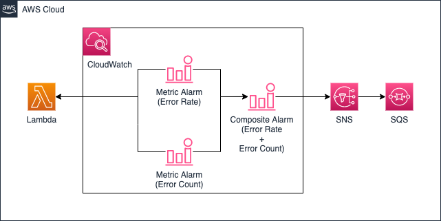

# Terraform による AWS CloudWatch Composite Alarm 作成デモ

## 構成



- Error Rate: Lambda が`(Errors / Invocations * 100) > 50`を満たす場合、アラーム状態となる
- Error Count: Lambda が`Errors > 10`を満たす場合、アラーム状態となる
- 上記 2 つのアラームの条件を両方満たす場合、つまり`ALARM(${project_name}-${env_name}-cloudwatch-alarm-error-rate) AND ALARM(${project_name}-${env_name}-cloudwatch-alarm-error-count)`という式を満たす場合、アラーム状態となり、アクションに登録された SNS へ Publish する
- 通知先は SQS を設定しているが、Email であったり、Lambda で Slack の Webhook URL を叩いたりと様々な通知先のパターンがある想定だが、今回は省力化のため SQS とする

## 前提条件

1. git がインストールされていること
1. terraform がインストールされていること（tfenv 導入がおすすめ）
   - terraform のバージョンは何でも良いが、現時点（2022/01/09）での最新バージョン=`1.1.3`とする
   - aws provider のバージョンは CloudWatch Composite Alarm を使用可能とするバージョン=`3.24.0`とする

## 使い方

1. このリポジトリを任意の場所に clone
   ```
   git clone https://github.com/kf3225/terraform-composite-alarm.git
   ```
1. provider.tf を自分の環境に合わせ、編集

   - bucket: state ファイルを保管するバケット名（事前に作成すること）
   - key: state ファイル名
   - region: region 名
   - profile: 使用する profile 名（~/.aws/credentials）

   ```
   terraform {
     required_version = "1.1.3"
     required_providers {
       aws = {
         source  = "hashicorp/aws"
         version = "3.24.0"
       }
     }
     backend "s3" {
       bucket  = "test-terraform-bucket-ap-northeast-1"
       key     = "dev.tfstate"
       region  = "ap-northeast-1"
       profile = "default"
     }
   }
   provider "aws" {
     region  = "ap-northeast-1"
     profile = "default"
   }
   ```

1. terraform init 実行

   ```
   cd terraform-composite-alarm
   terraform init
   ```

1. terraform plan 実行

   ```
   terraform plan
   ```

1. terraform apply 実行
   ```
   terraform apply -auto-approve
   ```

## 片付け方

1. terraform destroy 実行
   ```
   terraform destroy
   ```
